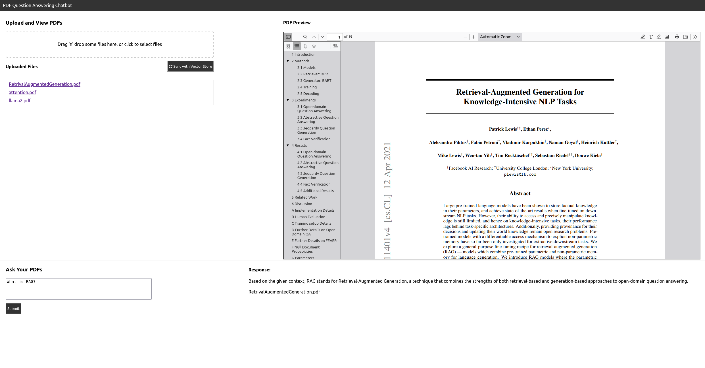
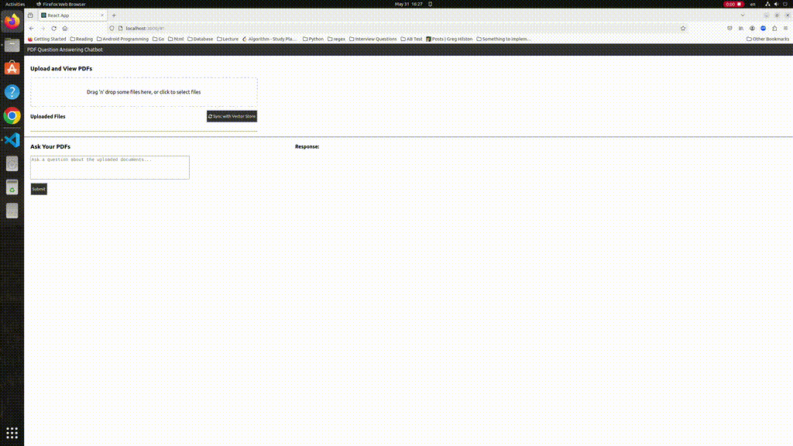

# Full-stack Document QA Mini Application

## Description
This mini web application allows users to upload PDF files and perform document question-answering about the uploaded files. It uses the technique called Retrival-augmented Generation (RAG) to first retrieve the relevant passage to the questions being asked across all uploaded files, and then genrate the answer using a large language model with the additional retrieved context.

## Demo

### Tech Stack
- LLM data framework: LlamaIndex
- LLM: [Meta Llama 2]([TheBloke/Llama-2-13B-chat-GGUF](https://huggingface.co/TheBloke/Llama-2-13B-chat-GGUF))
- Embedding Model: [Universal AnglE Embedding]([WhereIsAI/UAE-Large-V1](https://huggingface.co/WhereIsAI/UAE-Large-V1))
- VectorDB: PGVector (Postgres)
- Frontend: React
- Backend: Flask

## Next Step
- Add docker file for easy deployment
- Host DB in AWS